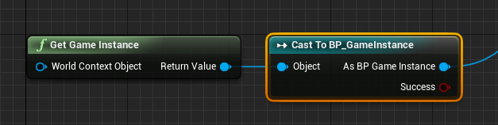

# Bluelua for UE4 #

用 Lua 替换蓝图脚本，保持和蓝图一致的使用方式，无缝切换。Lua 中使用反射去访问虚幻对象的属性和方法，无需生成胶水代码，更加简洁易扩展，对于经常访问的方法可以在 lua 中进行 cache，减少反射访问成本。

## 第三方开源库列表 ##

* [lua](https://www.lua.org/) : Lua is a powerful, efficient, lightweight, embeddable scripting language
* [luasocket](https://github.com/diegonehab/luasocket) : Network support for the Lua language
* [Tencent LuaPanda](https://github.com/Tencent/LuaPanda) : Pandora Lua Debugger for VS Code

## 特性 ##

* 直接在 lua 中调用 UFunction
* 直接在 lua 中访问 UClass/UStruct 的 UProperty 成员变量
* 可在 lua 中重写 C++ 中的 BlueprintNativeEvent/BlueprintImplementable 事件
* 可在 lua 中重写蓝图中的函数和事件
* 可在 lua 中重写 C++ 中的网络事件(Server/Client/NetMulticast)
* 可在 lua 中重写蓝图中的网络事件

## 使用 ##

复制到项目 *Plugins* 目录下即可

### 使用约定 ###

* `ILuaImplementableInterface`

    所有可用 lua 子类化的 C++ 类，都需要继承自该接口，并在对应的虚函数里调用相应的接口，主要几种类重载方式如下

    * 所有类(或蓝图)都需要重载两个重要的 `BlueprintNativeEvent`: `ShouldEnableLuaBinding` 和 `OnInitBindingLuaPath`
        * `ShouldEnableLuaBinding`: 返回是否开启 lua 绑定
        * `OnInitBindingLuaPath`: 返回绑定的 lua 文件路径
    
    * C++ 中可选择性重载 `OnInitLuaState`，返回自定义的 `FLuaState`，默认使用全局的 lua state

    * `AActor` 类，参见 [`LuaImplementableActor.h`](https://github.com/jashking/Bluelua/blob/master/Source/Bluelua/Public/LuaImplementableActor.h)
        * 在 `BeginPlay` 虚函数里调用 `OnInitLuaBinding`
        * 在 `EndPlay` 和 `BeginDestroy` 虚函数里调用 `OnReleaseLuaBinding`
        * 在 `ProcessEvent` 虚函数里调用 `LuaProcessEvent`

    * `UUserWidget` 类，参见 [`LuaImplementableWidget.h`](https://github.com/jashking/Bluelua/blob/master/Source/Bluelua/Public/LuaImplementableWidget.h)
        * 在 `NativeConstruct` 虚函数里调用 `OnInitLuaBinding`
        * 在 `NativeDestruct` 和 `BeginDestroy` 虚函数里调用 `OnReleaseLuaBinding`
        * 在 `ProcessEvent` 虚函数里调用 `LuaProcessEvent`

        Widget 类还有个特殊的地方，该类对象所拥有的 `LatentAction` 不受暂停影响，所以还需要重载 `NativeTick`，在该虚函数里调用 `LatentActionManager` 处理自己拥有的 `LatentAction` 对象

    * `UObject` 类，参见 [LuaActionRPG](https://github.com/jashking/LuaActionRPG) 例子中的 [`RPGAnimNotifyState.h`](https://github.com/jashking/LuaActionRPG/blob/master/Source/ActionRPG/Public/RPGAnimNotifyState.h)
        * 在 `BeginDestroy` 虚函数里调用 `OnReleaseLuaBinding`
        * 在 `ProcessEvent` 虚函数里调用 `LuaProcessEvent`
        * 因为 UObject 类没有一个初始化的虚函数可重载，所以可以在 `ProcessEvent` 第一次被调用时候进行初始化，详情见例子

    * `UGameInstance` 类，参见 [LuaActionRPG](https://github.com/jashking/LuaActionRPG) 例子中的 [`RPGGameInstanceBase.h`](https://github.com/jashking/LuaActionRPG/blob/master/Source/ActionRPG/Public/RPGGameInstanceBase.h)
        * 在 `Init` 虚函数里调用 `OnInitLuaBinding`
        * 在 `Shutdown` 和 `BeginDestroy` 虚函数里调用 `OnReleaseLuaBinding`
        * 在 `ProcessEvent` 虚函数里调用 `LuaProcessEvent`

* `Super`

    用 Lua 去子类化 Widget 或者 Actor 时候，会传入一个临时全局父类对象 Super，需要自己在 lua 里引用住

* `CastToLua`

    获取到一个虚幻对象后，判断该对象是否使用 lua 子类化，可以调用该对象的方法 `CastToLua`，如果使用了 lua 子类化则会返回一个 lua table，可以直接调用该 table 中的属性和方法，类似蓝图中将一个 C++ 对象转为蓝图对象，如图所示

    

* `Lua` 的模块化书写

    编写 lua 代码去子类化 C++ 或蓝图类时，必须采用模块化的写法，并且所有方法都采用 **:** 的声明形式，如下所示
    ``` lua
    local m = {}

    function m:func()
    end

    return m
    ```

* `Lua` 实现蓝图中的继承逻辑

    用蓝图编写逻辑时候，也可以类似 C++ 那样进行继承，在 Lua 中也可以利用元表实现 lua 对象间的继承，可以参见 [LuaActionRPG](https://github.com/jashking/LuaActionRPG) 中 [PlayerCharacter.lua](https://github.com/jashking/LuaActionRPG/blob/master/Content/Lua/Blueprints/PlayerCharacter.lua) 和 [Character.lua](https://github.com/jashking/LuaActionRPG/blob/master/Content/Lua/Blueprints/Character.lua)

* `Lua` 中重载 `BlueprintImplementableEvent` 和 `BlueprintNativeEvent` 方法时要注意，方法名要完全一致，比如 `BeginPlay` 事件，可重载的方法名其实叫 `ReceiveBeginPlay`。Lua 调用成员方法时也需要注意方法的命名问题，因为有时候在蓝图中看到的方法名称其实是个别名

## Samples ##

* [BlueluaDemo](https://github.com/jashking/BlueluaDemo): 性能对比测试和简单用法
* [LuaActionRPG](https://github.com/jashking/LuaActionRPG): 官方的 ActionRPG 示例，将蓝图逻辑替换为 lua 逻辑，尚未完全替换完

## TODO ##

* hot reload lua